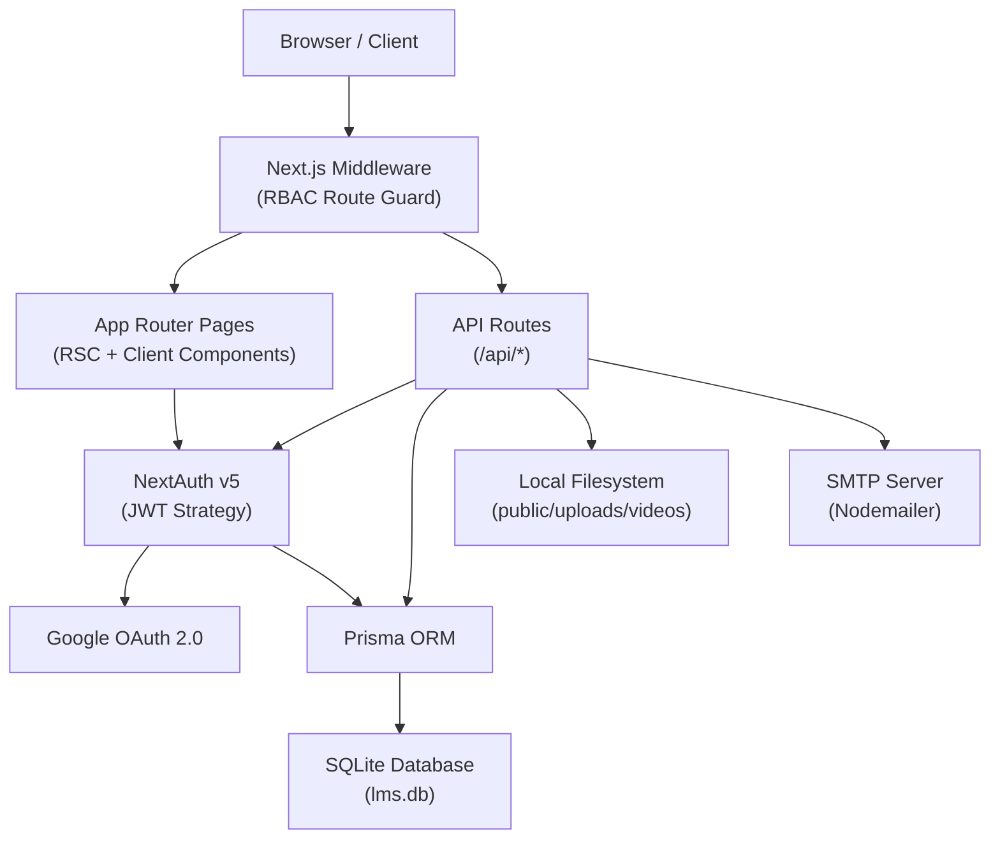
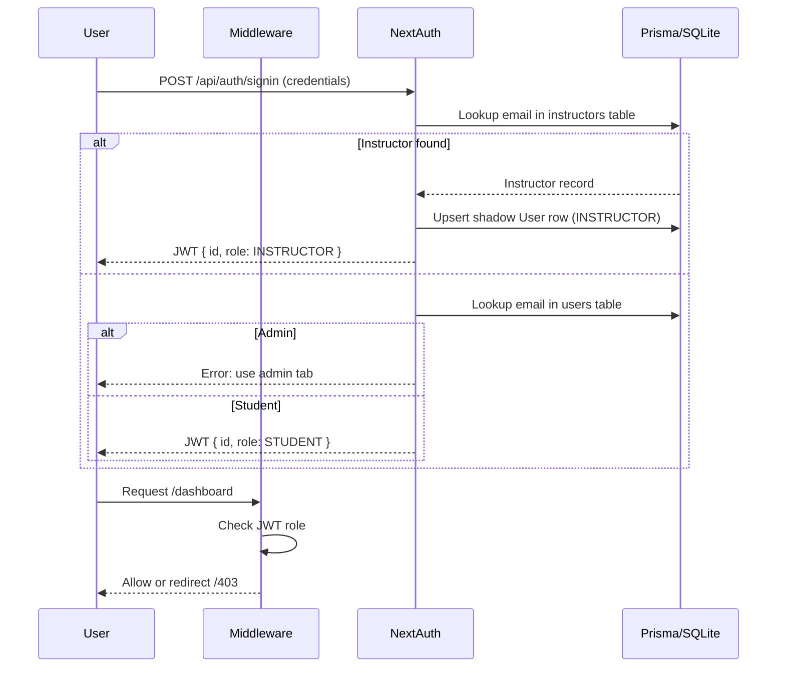
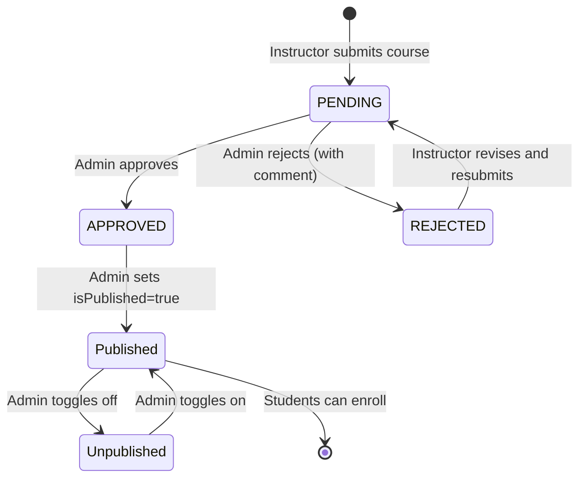
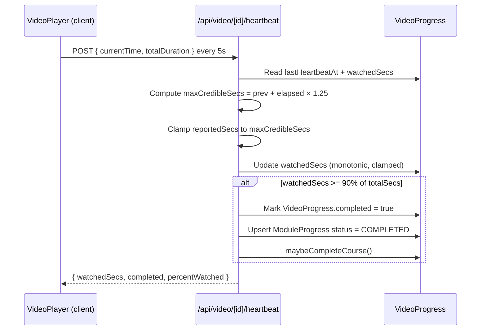
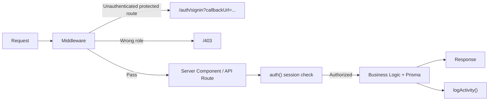
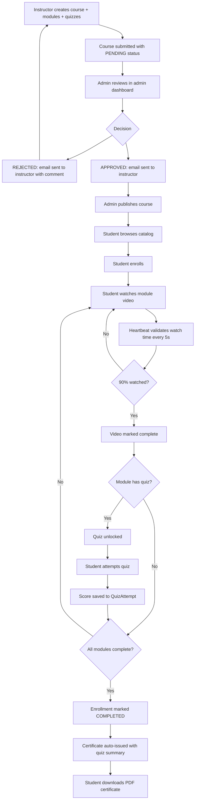
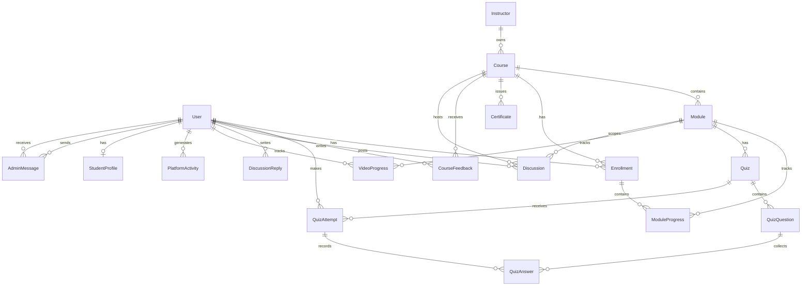

# NovaMind LMS

**A full-stack Learning Management System built with Next.js 15, Prisma, and NextAuth v5.**

NovaMind LMS is a production-grade web application that manages the full lifecycle of online education — from course creation and admin approval, through student enrollment and video-gated learning, to quiz assessment and PDF certificate issuance. It supports three distinct user roles (Student, Instructor, Admin) with hard-enforced routing guards and a unified authentication system spanning password login, OTP passwordless flow, and Google OAuth.

---

## Executive Summary

### Problem Solved

Existing open-source LMS tools either lack content governance (any instructor can publish anything) or require heavyweight infrastructure. NovaMind solves both: it enforces a **Pending → Approved → Published** course approval workflow controlled exclusively by admins, while running entirely on a single Next.js process backed by a SQLite database — deployable on any VPS or PaaS with zero external service dependencies beyond SMTP and optional Google OAuth.

### Target Users

- **Students** enroll in approved courses, watch sequentially gated videos, pass module quizzes, and receive verifiable PDF certificates.
- **Instructors** create and manage course content, monitor student engagement, and respond to student Q&A discussions.
- **Admins** review and approve courses, manage all users, moderate feedback and discussions, and monitor platform activity in real time.

### Core Workflows

1. Instructor submits course → Admin reviews and approves/rejects with written feedback → Admin publishes → Students enroll → Video + quiz completion triggers automatic certificate issuance.
2. Students authenticate via email/password, OTP (passwordless), or Google OAuth. Each path enforces role-aware routing and portal-hint cookie enforcement.
3. Admin messaging system enables direct communication between the admin and any student or instructor, with replies supported from either side.

---

## Key Features

| Feature | Purpose | Primary Role | Status |
|---|---|---|---|
| Course Approval Workflow | Admins control what content reaches students | Admin / Instructor | Implemented |
| Secure Video Streaming | HTTP Range-request streaming with anti-skip heartbeat | Student | Implemented |
| OTP Passwordless Login | Allows students to log in without a password via email code | Student | Implemented |
| Google OAuth with Portal Hints | Role-aware Google sign-in for students and instructors | All | Implemented |
| Module Quiz Engine | Timed multiple-choice quizzes with per-attempt scoring | Student | Implemented |
| PDF Certificate Generation | Automatic certificate with quiz performance summary | Student | Implemented |
| Anti-Skip Video Enforcement | Wall-clock heartbeat validation prevents position spoofing | Student | Implemented |
| Platform Activity Log | All key actions written to a typed audit trail | Admin | Implemented |
| Admin Messaging | Threaded private messages between admin and any user (students or instructors can reply) | Admin / All | Implemented |
| Course Feedback & Moderation | Star ratings and comments with admin hide/show controls | Student / Admin | Implemented |
| Q&A Discussions | Private per-student threads; instructors reply, pin, resolve, and hide | All | Implemented |
| Student Profile | Extended profile with college, education, bio, phone, avatar | Student | Implemented |
| Admin Statistics Dashboard | Platform-wide stat cards: enrollments, completions, ratings, pending courses, activity counts | Admin | Implemented |
| Admin Instructor Management | Admin can create instructor accounts directly from the dashboard | Admin | Implemented |
| Admin Course Creation | Admin can create courses on behalf of any instructor, bypassing the approval step | Admin | Implemented |
| Production HTTP Security Headers | CSP, HSTS, X-Frame-Options, X-Content-Type-Options, Referrer-Policy, Permissions-Policy | System | Implemented |

---

## System Architecture

### High-Level Architecture



### Authentication Flow



### Course Approval Flow



### Video Watch Enforcement



### Request Lifecycle



---

## User Roles

### Student

**Responsibilities:** Enroll in approved courses, progress through modules, complete quizzes, earn certificates.

**Permissions:** Read published courses, stream enrolled videos, submit quiz attempts, post feedback and discussions, view own certificates, update personal profile, message admin and reply to admin messages.

**Key Workflow:** Browse catalog → Enroll → Watch video (heartbeat tracked) → Pass quiz → Receive PDF certificate automatically upon 100% course completion.

> **Registration note:** New student accounts require email OTP verification before a password can be set. The registration flow sends an OTP to the provided email, verifies it, and only then allows password creation.

### Instructor

**Responsibilities:** Create and maintain course content, manage modules and quizzes, respond to student discussion threads.

**Permissions:** Create/edit own courses and modules, upload videos, manage own quizzes, view own student roster and feedback, reply to student discussions and pin/resolve/hide threads. Cannot publish own courses — that right belongs to Admin after approval. Instructors can only edit courses that are in PENDING or REJECTED status; approved/published courses are locked until re-review.

**Key Workflow:** Create course → Add modules + videos + quizzes → Submit for review → Receive admin feedback via email → Revise if rejected → Course published by admin.

### Admin

**Responsibilities:** Platform governance, content approval, user management, activity monitoring.

**Permissions:** Full CRUD on all entities, approve/reject/publish courses, create new instructor accounts, create courses directly (bypassing the approval step), hide feedback and discussions, message any user, view audit trail, access statistics dashboard.

**Key Workflow:** Monitor pending courses → Review and approve or reject with comment → Publish approved courses → Monitor activity feed → Manage messages and moderation.

---

## Product Workflow

### Complete Learning Cycle



> **Video gate note:** The quiz completion gate activates only when a module has a real uploaded MP4 file (`videoKey` is non-null). Modules without an uploaded video allow quiz access immediately. The gate checks `videoKey`, not `videoUrl`, to avoid blocking students on non-stream URLs.

---

## Technology Stack

| Technology | Version | Why It Exists |
|---|---|---|
| Next.js | 15.x | App Router provides co-located server components and API routes, eliminating a separate backend service. Server-side rendering gives SEO benefits for the public course catalog. |
| React | 18.x | Component model for the dashboard, video player, quiz engine, and admin panels. Framer Motion integration for transitions. |
| TypeScript | 5.x | Type safety across Prisma models, API request/response shapes, and NextAuth session extensions. |
| Prisma | 6.x | Type-safe ORM with schema-first migrations. Single source of truth for all database models. |
| SQLite (better-sqlite3) | 12.x | Zero-infrastructure database suitable for self-hosted deployments. Prisma abstracts it so migrating to PostgreSQL requires only a datasource change. |
| NextAuth v5 | beta.31 | Handles session JWT lifecycle, Google OAuth, and four credential providers (`credentials`, `admin-credentials`, `otp-credentials`, `google-otp-credentials`) in a single unified configuration. PrismaAdapter writes sessions to the database. |
| bcryptjs | 2.x | Password hashing for instructor and student credentials. |
| Nodemailer | 7.x | Transactional email for OTP codes, course approval notifications, and rejection feedback. |
| pdf-lib | 1.17.x | Programmatic PDF generation for course completion certificates with embedded quiz performance tables. |
| Tailwind CSS | 4.x | Utility-first styling. JIT compilation keeps the bundle lean. Configured via `@tailwindcss/postcss` (no separate `tailwind.config.js` file). |
| Framer Motion | 12.x | Page transitions and UI animations. |
| Lucide React | 0.383.x | Icon set consistent with the clean design language. |
| class-variance-authority | 0.7.x | Variant-driven component styling utilities. |
| clsx + tailwind-merge | — | Conditional class name composition. |
| tsx | 4.x | TypeScript execution for the Prisma seed script (`npm run db:seed`). |

> **Optional runtime dependency:** The video upload endpoint calls `ffprobe` (from the `ffmpeg` suite) to extract video duration automatically and populate `Module.videoDurationSecs` and `Module.durationMins`. If `ffprobe` is not installed on the server, the upload still succeeds — the duration fields are left at their existing values and the heartbeat system back-fills `videoDurationSecs` from the browser on first playback.

---

## Database Overview

### Entity Relationship Summary



### Core Entities

| Model | Purpose |
|---|---|
| User | All authenticated users (students, admins, instructor shadow rows) |
| Session / Account / VerificationToken | NextAuth session and OAuth account tables |
| Instructor | Separate instructor identity table with own credentials |
| StudentProfile | Optional extended profile (phone, bio, avatar, college, education) |
| Course | Course catalogue item with approval/publish lifecycle |
| Module | Individual lesson within a course; holds video metadata (`videoKey`, `videoUrl`, `videoMimeType`, `videoDurationSecs`) and optional Markdown content (`contentMd`) |
| Enrollment | Junction between User and Course; tracks completion status and price paid |
| ModuleProgress | Per-enrollment, per-module progress state |
| VideoProgress | Granular watch-time tracking with anti-skip heartbeat data |
| Quiz / QuizQuestion / QuizAttempt / QuizAnswer | Full quiz subsystem |
| Certificate | Issued on course completion; `isRevoked` / `revokedAt` / `revokedReason` fields exist in the schema for future use |
| CourseFeedback | Star rating + comment; moderatable (hide/show) |
| Discussion / DiscussionReply | Private per-student Q&A threads; students initiate, instructors and admins reply; threads support pin, resolve, and hide |
| PlatformActivity | Typed audit log for all significant events |
| AdminMessage | Threaded admin-to-user private messaging (students and instructors can reply) |
| OTPVerification | Single-use OTP tokens with expiry, attempt counter, and burn-on-use |
| OAuthPendingRegistration | Bridge record for new Google users awaiting onboarding |

---

## API Overview

All endpoints use the Next.js App Router and live under `app/api/`. Methods are as implemented in the codebase.

| Method | Endpoint | Auth Required | Role | Description |
|---|---|---|---|---|
| POST | /api/auth/send-otp | No | Public | Generate and email a 6-digit OTP (purposes: `register`, `forgot-password`, `google-onboarding`) |
| POST | /api/auth/verify-otp | No | Public | Validate OTP, return a short-lived verification token |
| POST | /api/auth/reset-password | No | Public | Reset password via OTP verification token |
| POST | /api/auth/store-portal | No | Public | Set `auth_portal` cookie for Google OAuth role hint |
| POST | /api/register | No | Public | Register new student account (requires prior OTP verification token) |
| GET | /api/student/dashboard | Yes | STUDENT | Enrolled courses, progress, certificates |
| POST | /api/enroll | Yes | STUDENT | Enroll in a published, approved course |
| GET/PATCH | /api/progress | Yes | STUDENT | Read or update ModuleProgress (quiz gate) |
| POST | /api/quiz/[id]/attempt | Yes | STUDENT | Submit quiz answers, receive score |
| GET | /api/video/[moduleId]/stream | Yes* | STUDENT+ | HTTP Range video streaming |
| POST | /api/video/[moduleId]/heartbeat | Yes | STUDENT | Report watch position (anti-skip) |
| POST | /api/video/[moduleId]/upload | Yes | INSTRUCTOR | Upload MP4 for a module (max 500 MB; validated by magic bytes, extension, and MIME type) |
| GET | /api/certificate/[id]/pdf | Yes | STUDENT | Download certificate as PDF |
| GET/POST | /api/feedback | Yes | STUDENT | Read course feedback or submit a new rating |
| PATCH | /api/feedback/moderate | Yes | ADMIN | Hide or unhide a feedback entry |
| GET/POST | /api/discussions | Yes | STUDENT / INSTRUCTOR / ADMIN | GET: students see only their own threads; instructors see all threads in their courses; admins see all threads globally. POST: students only — instructors and admins reply via the replies endpoint |
| GET/PATCH/DELETE | /api/discussions/[id] | Yes | STUDENT / INSTRUCTOR / ADMIN | Fetch, update (pin/resolve/hide/edit body), or delete a discussion |
| GET/POST | /api/discussions/[id]/replies | Yes | STUDENT / INSTRUCTOR / ADMIN | List or post replies to a discussion |
| PATCH/DELETE | /api/discussions/[id]/replies/[replyId] | Yes | STUDENT / INSTRUCTOR / ADMIN | Edit or delete a reply |
| GET/PATCH | /api/profile | Yes | STUDENT | Read or update student profile |
| GET/POST | /api/instructor/courses | Yes | INSTRUCTOR | List own courses or create a new course |
| GET/PATCH/DELETE | /api/instructor/courses/[id] | Yes | INSTRUCTOR | Manage own course (edit only when PENDING or REJECTED; resubmit a REJECTED course) |
| GET | /api/instructor/students | Yes | INSTRUCTOR | View own enrolled students |
| GET | /api/instructor/feedback | Yes | INSTRUCTOR | View feedback on own courses |
| GET | /api/instructor/discussions | Yes | INSTRUCTOR | View discussions on own courses |
| GET | /api/admin/stats | Yes | ADMIN | Platform-wide statistics |
| GET/POST | /api/admin/courses | Yes | ADMIN | List all courses (with optional `?status=` filter) or create a course directly (auto-approved) |
| GET/PATCH/DELETE | /api/admin/courses/[id] | Yes | ADMIN | View full course detail, approve/reject/publish/unpublish, or delete a course |
| GET | /api/admin/students | Yes | ADMIN | All students with enrollments, certificates, and activity log |
| GET/POST | /api/admin/instructors | Yes | ADMIN | All instructors with monitoring data (online status, activity log, course performance), or create a new instructor account |
| GET | /api/admin/feedback | Yes | ADMIN | All feedback across the platform |
| GET | /api/admin/discussions | Yes | ADMIN | All discussions across the platform |
| GET/POST | /api/admin/messages | Yes | ADMIN / STUDENT / INSTRUCTOR | Admin messaging: admin initiates threads; students and instructors can reply |
| GET | /api/admin/activity | Yes | ADMIN | Platform activity log |

*Free modules (`isFree = true`) skip the enrollment check at the API level and are streamable without authentication when the course is published and approved. Note that all course detail pages (`/courses/[slug]`) still require login via the middleware, so free streaming is only accessible to unauthenticated clients calling the API directly.

---

## Project Structure

```
lms/
├── app/                          # Next.js App Router root
│   ├── page.tsx                  # Public homepage
│   ├── layout.tsx                # Root layout (font, session provider)
│   ├── loading.tsx               # Global loading boundary
│   ├── error.tsx                 # Global error boundary
│   ├── globals.css               # Tailwind base + global styles
│   ├── 403/                      # Forbidden page (role mismatch)
│   ├── admin/                    # Admin portal pages
│   │   ├── page.tsx              # Admin dashboard (mounts AdminDashboardClient)
│   │   └── courses/new/          # Admin course creation form
│   ├── auth/                     # Authentication pages
│   │   ├── signin/               # Unified sign-in (student, instructor, admin tabs)
│   │   ├── register/             # Student registration (OTP → verify → set password)
│   │   ├── forgot-password/      # Password reset via OTP
│   │   ├── verify-otp/           # OTP entry page
│   │   ├── reset-password/       # New password entry
│   │   ├── google-onboarding/    # Profile completion for new Google OAuth users
│   │   └── error/                # NextAuth error page
│   ├── courses/                  # Public course catalog and detail pages
│   │   ├── page.tsx              # Course listing (publicly accessible, no auth required)
│   │   └── [slug]/               # Course detail / learning view (requires login)
│   ├── dashboard/                # Student learning dashboard
│   ├── instructor/               # Instructor portal pages
│   │   ├── page.tsx              # Instructor dashboard
│   │   └── courses/
│   │       ├── new/              # Create new course form
│   │       └── [id]/edit/        # Edit existing course
│   ├── quiz/[id]/                # Quiz attempt page
│   ├── certificate/[id]/         # Certificate view page
│   └── api/                      # API route handlers
│       ├── admin/                # Admin-only endpoints
│       ├── auth/                 # OTP, portal hint, password reset, NextAuth handler
│       ├── certificate/          # PDF generation
│       ├── discussions/          # Q&A thread management
│       ├── enroll/               # Enrollment logic
│       ├── feedback/             # Feedback submission and moderation
│       ├── instructor/           # Instructor-only endpoints
│       ├── profile/              # Student profile read/update
│       ├── progress/             # Module progress read/update
│       ├── quiz/                 # Quiz attempt submission
│       ├── register/             # Student registration
│       ├── student/              # Student dashboard data
│       └── video/                # Video upload, stream, heartbeat
├── components/                   # Shared React components
│   ├── admin/
│   │   └── AdminDashboardClient.tsx   # Full admin SPA (courses, students, instructors, messages, activity, feedback, discussions)
│   ├── certificate/
│   │   └── CertificateView.tsx        # Certificate display and PDF download trigger
│   ├── course/
│   │   ├── CourseDetailClient.tsx     # Course detail / module learning view
│   │   ├── CourseFeedback.tsx         # Star rating and comment submission
│   │   ├── CourseFormClient.tsx       # Course creation form (admin context)
│   │   ├── DiscussionSection.tsx      # Full Q&A thread UI
│   │   ├── ModuleLearningView.tsx     # Module content and progress UI
│   │   ├── VideoPlayer.tsx            # Custom HTML5 video player with 5-second heartbeat
│   │   └── VideoUpload.tsx            # Drag-and-drop MP4 upload component
│   ├── dashboard/
│   │   └── DashboardClient.tsx        # Student dashboard (enrollments, progress, certificates)
│   ├── instructor/
│   │   ├── CourseEditClient.tsx       # Instructor course editing UI
│   │   ├── CourseFormClient.tsx       # Course/module/quiz creation form
│   │   ├── InstructorDashboardClient.tsx  # Instructor dashboard (courses, students, discussions, feedback)
│   │   └── InstructorStudentsClient.tsx   # Instructor student roster view
│   ├── layout/
│   │   └── Navbar.tsx                 # Site navigation bar
│   └── quiz/
│       └── QuizPlayer.tsx             # Timed quiz UI with answer selection and scoring
├── lib/                          # Shared server utilities
│   ├── auth.ts                   # NextAuth configuration (4 credential + Google providers)
│   ├── prisma.ts                 # Prisma client singleton
│   ├── activity.ts               # Typed platform activity logger
│   ├── course-completion.ts      # Certificate issuance on course completion
│   ├── email.ts                  # Nodemailer transactional email templates (OTP, approval, rejection)
│   ├── pdf.ts                    # pdf-lib certificate PDF generator (A4 landscape)
│   ├── utils.ts                  # Utilities: cn(), generateOTP(), slugify()
│   └── rbac/
│       └── rbac-helpers.ts       # Page-level and API-level auth guards + resource permission checks
├── prisma/
│   ├── schema.prisma             # Database schema (single source of truth)
│   └── seed.ts                   # Development seed data (admin, instructors, sample courses)
├── public/
│   └── uploads/videos/           # Local video storage (gitignored)
├── middleware.ts                 # Edge RBAC route guard
├── next.config.ts                # Security headers, image domains, compression
├── postcss.config.mjs            # Tailwind CSS v4 PostCSS integration
├── package.json
├── tsconfig.json
└── .env.example                  # Environment variable template
```

---

## Local Setup

### Prerequisites

- Node.js 20+
- npm 10+

### Installation

```bash
git clone <repository-url>
cd lms
npm install
```

### Environment Variables

Copy `.env.example` to `.env` and fill in the values:

```env
# Database
DATABASE_URL="file:./prisma/lms.db"

# NextAuth
NEXTAUTH_URL="http://localhost:3000"
# Generate with: openssl rand -base64 32
AUTH_SECRET="<generate with: openssl rand -base64 32>"

# Google OAuth (optional — app runs without it)
GOOGLE_CLIENT_ID="<from Google Cloud Console>"
GOOGLE_CLIENT_SECRET="<from Google Cloud Console>"

# SMTP (required for OTP and approval emails)
SMTP_HOST="smtp.gmail.com"
SMTP_PORT="587"
SMTP_USER="<your-gmail@gmail.com>"
SMTP_PASS="<Gmail App Password — not your account password>"
SMTP_FROM="NovaMind LMS <your-gmail@gmail.com>"

# Seed (optional)
# Password for the admin@novamind.lms seed account. Defaults to "ChangeMe!2025"
ADMIN_SEED_PASSWORD="your-admin-password"
```

**`AUTH_SECRET`** is mandatory. The app throws at startup if it is missing. Generate one with:

```bash
openssl rand -base64 32
```

**`ADMIN_SEED_PASSWORD`** overrides the default seed password (`ChangeMe!2025`) for the admin account created during `npm run db:seed`. Set this before seeding in any non-local environment.

**Gmail App Password:** Enable 2-Step Verification on your Google account, then generate an App Password at `https://myaccount.google.com/apppasswords`. Use that 16-character code as `SMTP_PASS`. SMTP is required for OTP verification and course approval emails; the app throws a descriptive error at runtime if SMTP variables are missing or contain placeholder values.

**Google OAuth:** Optional. If `GOOGLE_CLIENT_ID` or `GOOGLE_CLIENT_SECRET` are absent, Google login is gracefully disabled and the buttons are hidden. When enabling it, add `http://localhost:3000/api/auth/callback/google` as an authorised redirect URI in Google Cloud Console.

### Database Setup

```bash
# Push schema and seed development data (single command)
npm run setup

# Or step by step:
npm run db:push   # Apply schema to SQLite
npm run db:seed   # Seed admin, instructors, and sample courses
```

### Seeded Credentials

After running `npm run db:seed` (or `npm run setup`):

| Role | Email | Password |
|---|---|---|
| Admin | admin@novamind.lms | `ChangeMe!2025` (or `ADMIN_SEED_PASSWORD`) |
| Instructor | alex@novamind.lms | `instructor123` |
| Instructor | sarah@novamind.lms | `instructor123` |

> **Video upload note:** All seeded modules have no video (`videoUrl=null`, `videoKey=null`). Instructors must upload real MP4 files via the VideoUpload component. Quizzes are immediately accessible on a fresh install because the video gate only activates once an MP4 has been uploaded.

### Run Development Server

```bash
npm run dev
```

Open `http://localhost:3000`.

### Inspect Database

```bash
npm run db:studio
```

---

## Scripts Reference

| Script | Command | Description |
|---|---|---|
| `dev` | `next dev` | Start development server with hot reload |
| `build` | `next build` | Compile and optimise for production |
| `start` | `next start` | Run the production build |
| `lint` | `next lint` | Run ESLint across the codebase |
| `db:push` | `prisma db push` | Apply `schema.prisma` to the SQLite database (no migration files) |
| `db:seed` | `tsx prisma/seed.ts` | Seed admin, instructors, and sample courses |
| `db:studio` | `prisma studio` | Open Prisma Studio database browser |
| `setup` | `prisma db push && tsx prisma/seed.ts` | Full first-run database initialisation |

---

## Security

`next.config.ts` sets the following HTTP response headers on every route:

| Header | Value | Notes |
|---|---|---|
| `X-Frame-Options` | `DENY` | Prevents all framing (clickjacking protection) |
| `X-Content-Type-Options` | `nosniff` | Prevents MIME-type sniffing |
| `Referrer-Policy` | `strict-origin-when-cross-origin` | Limits referrer leakage across origins |
| `Permissions-Policy` | `camera=(), microphone=(), geolocation=()` | Disables sensitive browser APIs |
| `Strict-Transport-Security` | `max-age=63072000; includeSubDomains; preload` | Production only (omitted in development) |
| `Content-Security-Policy` | See below | Restricts script, style, media, and connect sources |
| `X-Powered-By` | *(removed)* | `poweredByHeader: false` suppresses the header |

The CSP allows `'unsafe-inline'` for styles and (in development only) `'unsafe-eval'` for scripts. The `connect-src` directive explicitly permits `accounts.google.com`, `oauth2.googleapis.com`, and `www.googleapis.com` for Google OAuth flows. In production, `upgrade-insecure-requests` is also added.

---

## Deployment

### Production Build

```bash
npm run build
npm run start
```

### Environment Checklist

- Set `NEXTAUTH_URL` to your production domain (e.g., `https://lms.yourcompany.com`)
- Regenerate `AUTH_SECRET` for production: `openssl rand -base64 32`
- Set a strong `ADMIN_SEED_PASSWORD` before running the seed in production
- Update Google Cloud Console OAuth redirect URI to the production callback URL
- Configure a production SMTP provider (SendGrid, AWS SES, Postmark) in place of Gmail
- Ensure `public/uploads/videos/` is on persistent storage (not ephemeral) — consider migrating to S3/R2 for cloud deployments
- If video duration extraction is needed, install `ffprobe` (part of the `ffmpeg` package) on the server. The app functions without it but will not auto-populate video durations at upload time.
- Do not commit `.env`; inject environment variables from your hosting platform

### Database Migration (SQLite to PostgreSQL)

1. Change `prisma/schema.prisma` datasource provider from `"sqlite"` to `"postgresql"`
2. Update `DATABASE_URL` to a PostgreSQL connection string
3. Run `npx prisma migrate dev` to generate and apply migration files
4. No application code changes required — Prisma abstracts the provider

---

## Future Improvements

### Near-Term

- **Cloud Video Storage** — Replace local filesystem video storage with S3-compatible object storage (AWS S3, Cloudflare R2). The `videoKey` field in Module already acts as a storage key; the stream route needs a presigned-URL redirect.
- **PostgreSQL Migration** — SQLite is suitable for low-to-medium concurrent traffic but does not support horizontal scaling. Switching to PostgreSQL requires only a Prisma datasource change.
- **Payment Integration** — The `Course.price` and `Enrollment.pricePaid` fields exist but no payment gateway is wired. Stripe Checkout integration is the natural next step.
- **Certificate Revocation UI** — The `Certificate` model includes `isRevoked`, `revokedAt`, and `revokedReason` fields and the stats endpoint filters on `isRevoked: false`, but no admin UI or API endpoint for revoking certificates has been implemented yet.
- **Email Queue** — Transactional emails are sent synchronously inside API handlers. For reliability under load, enqueue with a worker (BullMQ + Redis or similar).

### Medium-Term

- **Admin-Managed OTP for Instructors** — Instructors currently require a password. OTP login parity would eliminate password management for instructors.
- **Course Versioning** — Published courses cannot currently be significantly revised without re-entering the approval queue. A draft/version system would allow iterative content updates.
- **Student Notifications** — No in-app notification system exists. Server-Sent Events or WebSocket push for course updates and discussion replies would improve engagement.
- **Content CDN** — Video serving through a CDN edge would reduce origin server load and improve global playback performance.

### Long-Term

- **Multi-tenancy** — The current schema is single-tenant. Introducing an `Organization` model would allow the platform to serve multiple independent LMS instances.
- **SCORM / xAPI Support** — Enterprise buyers often require SCORM-compliant content import. xAPI (Tin Can) integration would enable external LRS compatibility.
- **Mobile Application** — The API layer is fully decoupled from the Next.js frontend. A React Native app could consume the same API routes.
